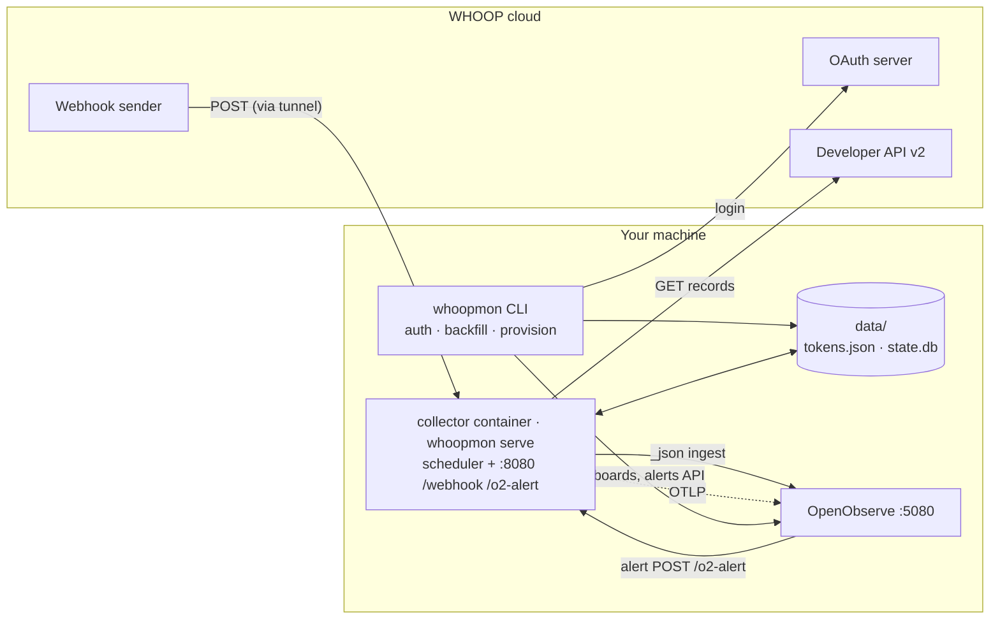
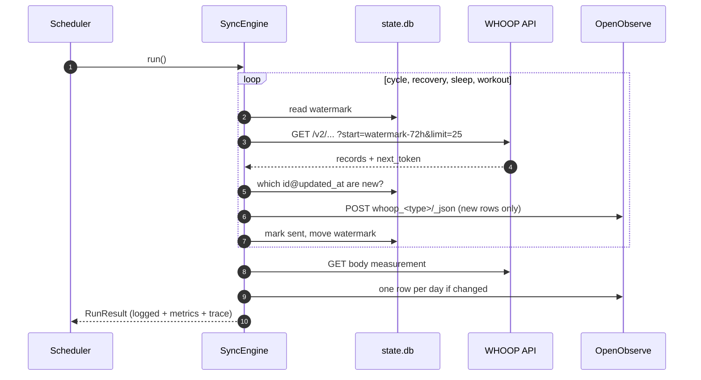

# Architecture

## Components

| Module | Job |
|---|---|
| `auth/` | OAuth login, callback server, token store with file lock and atomic write |
| `whoop/` | HTTP client (auth, 429, retries), pagination, resource catalog |
| `transform/` | Nested record → flat row; event time, local date, hours columns |
| `sinks/` | OpenObserve `_json` bulk ingest |
| `sync/` | Engine (watermarks, de-dup), scheduler, SQLite state |
| `webhook/` | HMAC check, de-dup by `trace_id`, queue, OpenObserve alert receiver |
| `provision/` | Dashboards and alerts as code |
| `observability/` | structlog, OTel traces/metrics/logs, redaction |

## One sync run

## Key decisions

| Decision | Reason | ADR |
|---|---|---|
| Python, one package, Typer CLI | Small codebase, good OTel and HTTP libraries | [0001](docs/adr/0001-python-collector.md) |
| Poll first, webhooks optional | No cycle webhooks exist; polling needs no public URL | [0002](docs/adr/0002-poll-first.md) |
| Append + `record_key` de-dup, latest-row SQL | OpenObserve has no update; WHOOP re-scores records | [0003](docs/adr/0003-append-and-dedupe.md) |
| `_timestamp` = event time | Time picker filters by when things happened | [0003](docs/adr/0003-append-and-dedupe.md) |

## Failure handling

| Failure | Behaviour |
|---|---|
| 401 | Refresh token once under a file lock, then retry |
| 429 | Wait `X-RateLimit-Reset` + 1 s, then retry (max 5) |
| 5xx / network | Exponential backoff with jitter, max 5 tries |
| OpenObserve rejects rows | Run fails; rows stay "unsent" and go again next run |
| Crash mid-run | Watermark and sent-keys move only after a write succeeds |
