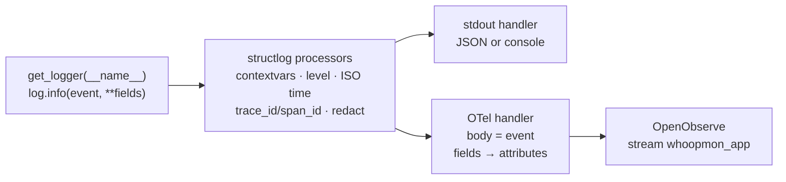

# Logging standard

## Rules

1. Log with `get_logger(__name__)`. Never use `print` in library code.
2. One event = one line of JSON.
3. The event name is `area.object.past_tense_verb`, for example `sync.run.finished`.
4. Put data in fields, not in the message. Use `log.info("sink.write.completed", rows=25)`,
   not `log.info(f"wrote {rows} rows")`.
5. Keep one type per field name across all events. OpenObserve fixes a column's type on first
   sight; a string `rows` in one event breaks `SUM(rows)` for every other event.
6. Never log tokens, the client secret, the auth code or personal data. The redact processor
   is a safety net, not a licence.

## Pipeline



## Fields

| Field | Example | Source |
|---|---|---|
| `timestamp` | `2026-10-05T06:15:02.114Z` | structlog, UTC |
| `level` / `severity` | `info` / `INFO` | stdout / OpenObserve |
| `event` / `body` | `sync.run.finished` | stdout / OpenObserve |
| `logger` | `whoopmon.sync.engine` | module name |
| `run_id` | `1791145041-c8475210` | bound for a whole sync run |
| `trace_id`, `span_id` | `4bf92f35…` | current OTel span |
| `resource` | `sleep` | WHOOP data type |
| `path`, `status`, `duration_ms` | `/v2/cycle`, `200`, `184` | WHOOP requests |
| `ratelimit_remaining` | `97` | `X-RateLimit-Remaining` |
| `stream`, `rows` | `whoop_sleep`, `25` | sink writes |

## Levels

| Level | Use for |
|---|---|
| `debug` | Each HTTP request. Off by default. |
| `info` | Normal milestones: run started/finished, rows written, token refreshed |
| `warning` | Handled problems: 429, retry, 401 before refresh, duplicate webhook |
| `error` | The operation failed: run failed, refresh failed, rows rejected |

Set with `LOG_LEVEL`. Set `LOG_FORMAT=console` for readable local output.

## Event catalogue

| Event | Level | Key fields |
|---|---|---|
| `sync.run.started` / `sync.run.finished` | info | `mode`, `outcome`, `duration_ms`, `<type>_shipped` |
| `sync.run.failed` | error | exception |
| `sync.resource.completed` | info | `resource`, `fetched`, `shipped`, `pending_score` |
| `whoop.request.completed` | debug | `path`, `status`, `duration_ms`, `ratelimit_remaining` |
| `whoop.request.rate_limited` | warning | `path`, `wait_s` |
| `whoop.request.retrying` | warning | `attempt`, `wait_s`, `reason` |
| `whoop.request.failed` | error | `path`, `status` |
| `auth.token.refreshed` / `auth.token.refresh_failed` | info / error | `expires_in_s` / `error` |
| `sink.write.completed` / `sink.write.failed` | info / error | `stream`, `rows` / `status` |
| `webhook.event.queued` / `.duplicate` / `.failed` | info / info / error | `type`, `whoop_trace_id` |
| `webhook.signature.invalid` | warning | — |
| `alert.received` | warning | `alert`, `stream`, `count`, `alert_rows` |

## Query examples (OpenObserve → Logs → `whoopmon_app`)

```sql
-- failed runs with their error
SELECT _timestamp, run_id, error FROM "whoopmon_app" WHERE body = 'sync.run.failed'

-- every log line of one run
SELECT _timestamp, severity, body FROM "whoopmon_app" WHERE run_id = '1791145041-c8475210'

-- rows shipped per stream per day
SELECT histogram(_timestamp, '1 day') AS d, stream, SUM(CAST(rows AS BIGINT)) FROM "whoopmon_app"
WHERE body = 'sink.write.completed' GROUP BY d, stream
```

From a log line, click the `trace_id` to open the trace of that run.

## Metrics (OTLP → OpenObserve metrics)

`whoopmon.api.requests`, `whoopmon.api.duration`, `whoopmon.api.rate_limited`,
`whoopmon.api.ratelimit_remaining`, `whoopmon.records.fetched`, `whoopmon.records.shipped`,
`whoopmon.auth.token_refreshes`, `whoopmon.sync.runs`, `whoopmon.sync.duration`,
`whoopmon.webhook.events`.
