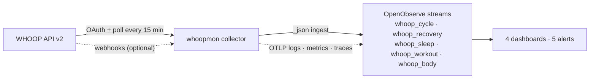

# whoop-monitoring

Collect your WHOOP data and see it in OpenObserve.

`whoopmon` reads the WHOOP Developer API v2. It writes recovery, sleep, strain, workouts and
body measurements to OpenObserve log streams. It also sends its own logs, metrics and traces
to OpenObserve over OTLP. Dashboards and alerts are code in this repo.



## Quick start

You need: Python 3.12+, Docker, a WHOOP membership, and OpenObserve on `:5080`.

```bash
cp .env.example .env              # 1. fill WHOOP_CLIENT_ID/SECRET and O2_USER/PASSWORD
make install                      # 2. create .venv
make login                        # 3. approve access in the browser
make backfill SINCE=2024-01-01    # 4. load history
make provision                    # 5. create dashboards in OpenObserve
make up                           # 6. start the 15-minute collector in Docker
```

Open <http://localhost:5080> → **Dashboards** → **WHOOP · Readiness**.

Full procedure, including the WHOOP developer app: [SETUP.md](SETUP.md).

## What you get

| Dashboard | Shows |
|---|---|
| WHOOP · Readiness | Recovery %, zone, HRV with 7-day mean, resting HR, SpO2, skin temp |
| WHOOP · Sleep | Stages per night, need vs actual, performance/efficiency/consistency, respiratory rate, naps |
| WHOOP · Strain & Training | Day strain, steps, kcal, HR-zone minutes per week, sport mix, workouts |
| WHOOP · Collector Health | Sync runs, rows shipped, 429s, errors, run duration |

| Alert | Fires when |
|---|---|
| `whoop_recovery_red` | Recovery is below 34 % |
| `whoop_hrv_drop` | Latest HRV is 20 % below the 7-day mean |
| `whoopmon_sync_stalled` | No good sync for 60 min |
| `whoopmon_sync_failed` | A sync run fails |
| `whoopmon_token_refresh_failed` | WHOOP token refresh fails |

## Commands

```text
make help        all targets
make check       lint + typecheck + tests (what CI runs)
make doctor      check WHOOP token and OpenObserve
make sync        one sync from the host
make logs        follow the collector container
make tunnel      public HTTPS URL for WHOOP webhooks (optional)
make test-integration   run every dashboard/alert query on the local OpenObserve
```

## Docs

| File | Content |
|---|---|
| [SETUP.md](SETUP.md) | Step-by-step setup |
| [ARCHITECTURE.md](ARCHITECTURE.md) | Components, data flow, design decisions |
| [LOGGING.md](LOGGING.md) | Log schema, levels, redaction, how to query |
| [docs/data-dictionary.md](docs/data-dictionary.md) | Every stream and column |
| [docs/runbook.md](docs/runbook.md) | What to do when something breaks |
| [docs/adr/](docs/adr) | Architecture decision records |
| [SECURITY.md](SECURITY.md) · [PRIVACY.md](PRIVACY.md) | Secrets, tokens, personal data |

## Disclaimer

This is a personal, unofficial project. It is not made, endorsed or supported by WHOOP, Inc.
"WHOOP" is a trademark of WHOOP, Inc. and is used here only to name the API this tool reads.

## Limits

The WHOOP API gives scored data only. There is no continuous heart rate, no Stress Monitor and
no Journal. Rate limits are 100 requests/min and 10,000/day; one sync uses about 5–8.
